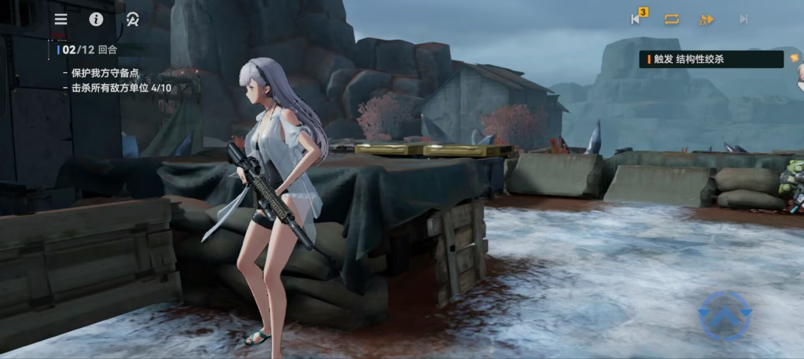
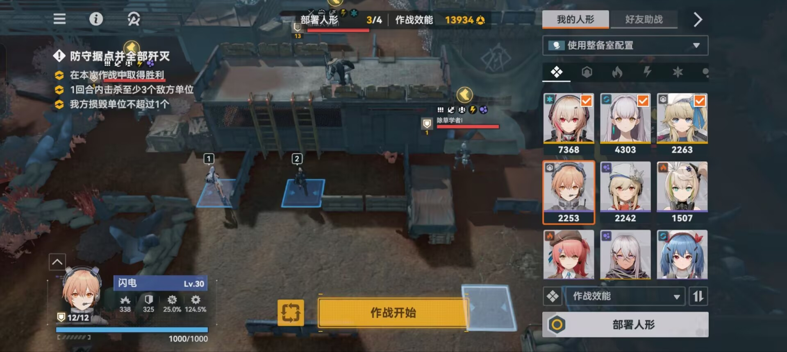
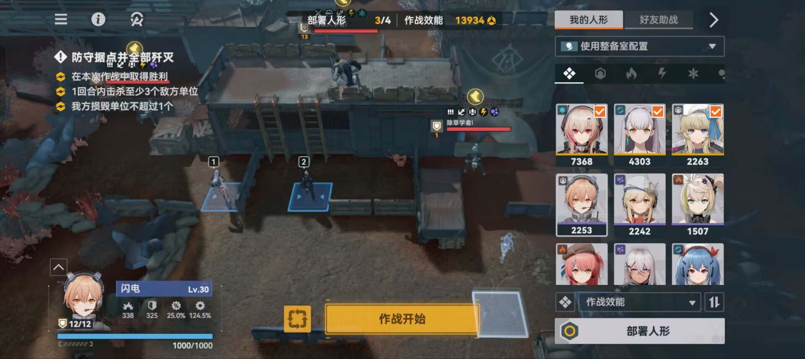
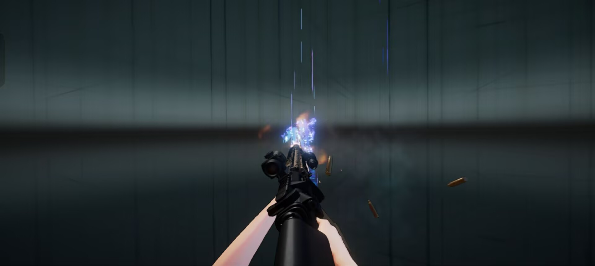
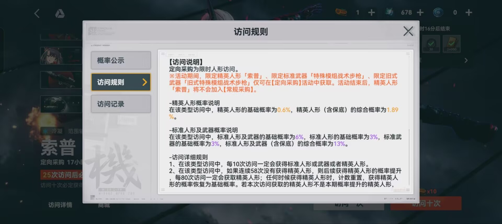
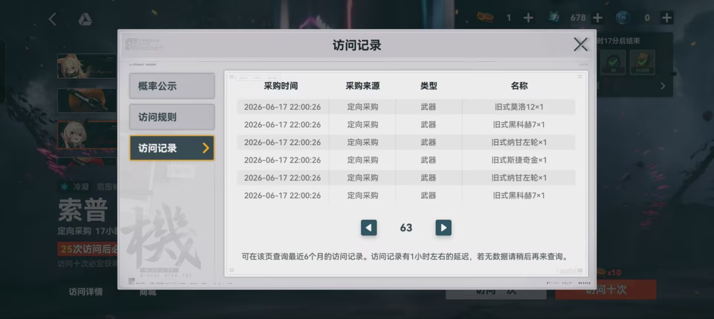

# 金玉其外，体验其内——《少女前线2：追放》的拆解与反思

## 引言

2023年12月，《少女前线2：追放》（以下简称《少前2》）全球上线。作为散爆网络的首款全3D二次元游戏，它承载着《少女前线》IP近十年的积淀与期待。上线首月，海外全平台预估流水即达4亿元，截至2025年1月10日海外收入达3300万美元——从商业成绩看，它无疑是成功的。

**然而，商业的成果并不能遮掩其设计的失败。**

豆瓣上大量两星以下的评价，Tap Tap上“玩法非常无趣。全程自动完全没在玩”的玩家反馈，NGA论坛上“除了建模其他都不行”的尖锐批评——这些声音指向同一个问题：**《少前2》拥有业界顶级的3D美术资产，却在基础交互体验和核心玩法设计上有着巨大的豁口。**

## 一、美术的“加法”与交互的“减法”

### 1.1 顶级美术资源的错误使用

客观来看《少女前线：追放》拥有着2023年手游市场上最顶级的3D和2D美术资源，并且玩家也普遍认可其建模水准。Tap Tap上有玩家评价“建模：顶级。渲染好看，各种小挂饰也都有独立建模，无人体彩绘”。豆瓣评论同样承认“人物建模非常真实，极高的物理引擎”。

但是，**成也美术，败也美术**。即使拥有入此顶尖的美术资源，却没有在正确的游戏时间中被利用，有时反而成为了游戏体验的累赘，要是说的更难听点，那就是《少女前线：追放》除了美术资源，没有拿得出手的东西了。

作为一款俯视角战棋玩法为核心玩法的游戏，实际上，局内体验时，能观察到的游戏建模的细节是有限的，按照行业以往的做法，那就是简化局内角色模型，强化角色特征。可是，少女前线却一反常态地使用原型建模作为局内游戏建模，他们解决“无法看到所有细节”的方法却是——**直接在自动作战时强行使用第三人称视角来跟随行动中的角色，强行让玩家看到建模细节**。可是他们就是没有意识到，玩家真正能够专注的时候是自己上手操作的时候，自动作战反而没有人会去关注游戏内容，这实在是可笑的。

与此同时，剧情中却大量使用2D立绘对话，而非3D实时演算。玩家在“精致的3D战棋”和“复古的2D立绘”之间频繁切换，体验割裂的同时感觉到意义不明。

### 1.2部署操作：反直觉的设计案例

如果说美术投入的错位是**战略问题**，那么部署操作的冗余就算**战术灾难**。

大多数的策略类型的游戏，部署操作都遵循**直觉交互的原则**：玩家点击角色 -> 拖拽到空位或者直接自动填补空位 ->完成部署。但是，《少女前线：追放》却选择使用两套部署方案，而且，居然在教学中只教玩家使用最繁杂的操作：**点击空位 -> 选择角色 -> 确认角色 ->点击下一个空位** 的循环操作。而简单易操作的**拖拽放置**却被隐藏，只能等玩家无意间发现。这只能证明，官方制作组在项目初期只考虑到最简单易通的循环验证操作，但是因为这个操作被写死，导致就算后来有了拖拽功能也没有删除，这体现了系统策划与关卡策划的交流不当，导致教学关卡没有将实际的所有功能体现出来。

**点击放置**

**拖拽放置**

### 1.3游戏流程设计：无端时间消耗

当本应快速响应的操作被不可跳过的过场动画强行占据时，玩家的有效游玩时间便被无端侵蚀。《少女前线：追放》在这方面的问题尤为突出。

**首先其角色终极技能的释放动画完全不可跳过**，无论是手动操作还是自动战斗，每次释放大招都必须完整播放一段固定的过场演出。游戏设计团队的初衷不难理解——他们希望通过这种方式展示游戏出色的美术资产，但这一意图在执行层面走向了错误的方向。对于需要频繁释放技能的玩法而言，相同动画的反复播放不仅迅速变得乏味，更会在玩家试图连续操作时造成节奏上的断裂，严重干扰心流的维持，进而削弱持续游玩的动力。

类似的问题在《Fate/Grand Order》（FGO）中同样存在。作为一款上线较早的二次元手游，FGO的宝具动画系统从底层架构上就埋下了隐患：开发初期并未预见到未来关卡会趋向冗长化与重复化，因此没有在动画播放流程中预留可强行中断的接口。这导致即便运营多年、玩家反复呼吁，官方也只能通过加速动画播放来缓解痛点，而无法真正实现跳过功能。

另一种合理的推断是：这两款游戏都将过场动画与技能特效的播放逻辑**深度绑定**，动画本身即是特效渲染的容器。若强行中断动画，很可能导致特效显示异常或技能逻辑无法正常结算。正是这种底层耦合，使得“跳过动画”在技术实现上成为一项难以触碰的改动。

归根结底，**展示资源的需求不应凌驾于玩家的操作效率之上**。当“播片”成为玩法节奏的绊脚石，再精美的演出也难以挽回流失的注意力。

其次，**升级动画的设计同样存在冗余且消耗有效游玩时间的问题**。在《少前2》中，任何角色的等级提升或阶位晋升，在选择确认后都会触发一段几乎毫无差异的过场动画。尽管官方后续加入了点击跳过的功能，但从设计本质来看，这并非一个“加个跳过按钮就能圆过去”的问题。

升级系统在手游乃至所有网络游戏中，都应当服务于**高频次、高效率的养成操作**——玩家需要快速完成升级闭环，并清晰获取数值成长的结果反馈。而在这一环节中强行嵌入过场动画，本质上是与“快速操作”的设计目标背道而驰——动画本身无法直观呈现攻击力、生命值等关键数据的提升，反而打断了连续养成的流畅感。一个可能的解释是，开发团队依然延续了“以美术展示为核心”的设计惯性，试图通过升级动画强化建模表现。然而，这种做法非但不能激发玩家对角色的热情，反而因阻碍养成效率、干扰快速成长反馈，对玩家的持续留存产生了实际的负面影响。

## 二.自动作战：主动放弃策略玩法

### 2.1 过早开放自动 = 放弃战棋

如果说UI和交互问题还能归咎于“经验不足”，那么自动战斗的设计决策，则触及了《少前2》最核心的**设计伦理问题**。

**《少前2》在新手第三关就开放了自动战斗。**

这意味着，玩家还没来得及完整体验战棋的“观察棋盘→思考走位→预判敌袭→执行操作→获得反馈”这一核心心流循环，系统就递上了一个“替玩家思考”的按钮。

战棋游戏的灵魂在于**“战中策略”**——走位、卡位、集火优先级、技能释放时机——这些决策必须在战场上即时做出，无法被战前配置完全替代。**当玩家在未通关的关卡就可以直接点击“自动”时，等于开发组亲口告诉玩家：“我们的关卡设计不值得你动脑子。”**

### 2.2自动作战的策略发生点：横向对比其他游戏

| 游戏名称       | 策略发生点                           | 自动作战的逻辑             | 效果                                   | 收益                       |
| -------------- | ------------------------------------ | -------------------------- | -------------------------------------- | -------------------------- |
| 少女前线：追放 | 战中策略（配队）                     | 完全交付AI                 | 完全交付AI，玩家没有展现自身策略的余地 | 只有首次作战收益           |
| 明日方舟       | 战前、中策略（配队、放置、技能释放） | 记录玩家操作，复用玩家操作 | 减轻了玩家重复游玩的压力               | 分为首次收益和重复作战收益 |
| 阴阳师         | 战前策略（配队、御魂）               | 根据玩家要求的行为规则操作 | 减少了玩家的重复操作                   | 分为首次收益和重复作战收益 |

《明日方舟》的“代理指挥”有一条铁律：**你必须先凭实力三星通关，才能解锁自动**。这个门槛意味着玩家在点击“自动”之前，已经完成了一次完整的“策略闭环”。胜利的成就感是实打实的，“自动”是对玩家智力的尊重——**“你凭本事赢了，现在可以把重复劳动交给系统。”**而且明日方舟的社区也存在一套自动战斗——“抄作业”，不仅没有影响到正常玩家的策略体验，也为轻度玩家提供了推进游戏进度的后路。

而《少前2》在未通关时就开放自动，等于把“策略闭环”砍成了“配队→挂机→看结果”的数值对赌。有玩家在评论中直言：“游戏是真不好玩。基本上就是自动战斗。现在老实说不带自动战斗不想玩。带自动战斗很无聊”。

**当玩家养成“反正可以自动”的习惯后，战棋的“棋”字就死了，策略玩法成为了只存在于游戏标签里面的词了。**

## 三、抽卡概率设计的死穴：玩家期待值过低

作为一款2023年上线的二次元手游，《少女前线：追放》在抽卡体验方面存在着显著的问题——不仅基础概率设置极为保守，社区与论坛中更有大量玩家反馈其存在“概率疑似与实际不符”的质疑。综合玩家反映来看，大多数人的抽卡体验较为负向，许多人被迫依靠硬性保底机制获取当期角色，而卡池承诺的UP概率在实际体验中几乎无感知。

与此同时，保底触发门槛也远高于行业同类产品。以80抽为硬保底基准，辅以极为有限的资源获取渠道：一次活动期间，玩家通过任务最多仅能获取约20抽资源，即便叠加支线、日常与周常任务，零氪玩家可支配的总抽数通常也仅能维持在30抽左右。换言之，**绝大多数零氪或轻氪玩家，在活动持续期间甚至无法攒足一次保底所需的抽数**，也就意味着无法确保获得当期UP角色。

这种设计形成了一种封闭式的负循环：玩家有意获取角色 → 发现资源积累不足以覆盖保底线 → 评估氪金成本 → 定价偏高（不仅单价昂贵，且充值回报率偏低）→ 放弃当期卡池 → 要么长期囤积资源等待“真正值得”的角色，要么因长期缺乏获得感而选择流失。

可以推测，散爆网络运营方的初衷或许是：资源不足 → 引导玩家付费补齐。但这一逻辑的前提，是玩家对产品本身具备足够的情感粘性与信任储备——即足够强大的IP号召力与品牌信用背书。以《火影忍者》手游为例，其之所以能在类似模式中实现转化，除了依托顶级IP的粉丝基础，更重要的是腾讯作为发行方所具备的平台信任度，这使得玩家即使对商业化手段抱有不满，也依然愿意为内容本身买单。

然而，散爆作为中型厂商，既不具备《火影忍者》级别的IP辐射力，也尚未在玩家群体中建立起足够的信任积淀。在此前提下直接套用“以卡池压力驱动付费”的强商业策略，不仅难以实现预期效果，反而更可能加速轻度与零氪玩家的流失意愿，构成一种对用户基础的消耗性操作。

## 总结

《少女前线：追放》是一款在视觉上用力过猛、在体验上却处处失守的产品。它拥有新时代二游中顶尖的美术资产，却交付了一套反直觉的操作系统、一个自毁长城的自动战斗机制，以及一个几乎不给零氪玩家留活路的抽卡体系。当开发团队将“展示资源”置于“服务玩家”之上时，再精致的建模也不过是金玉其外的空壳——这，就是散爆在这款游戏上最致命的战略误判。